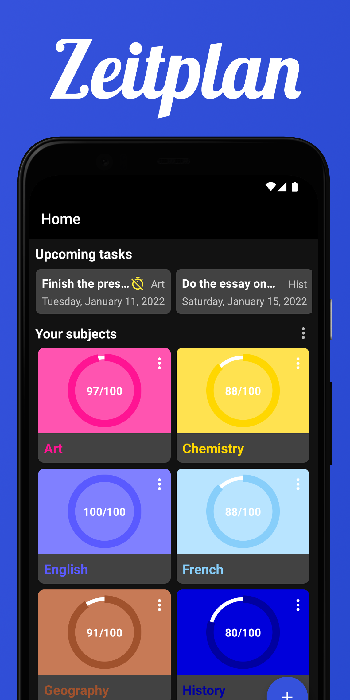
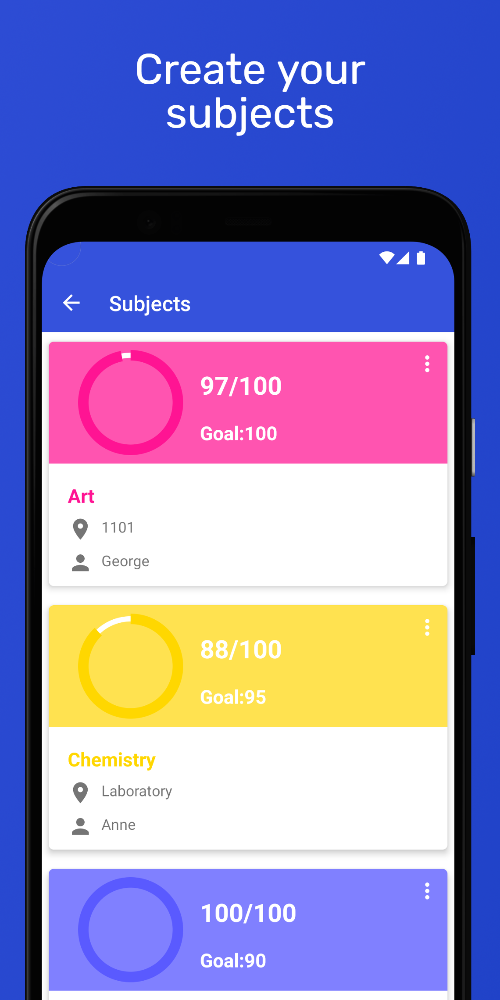
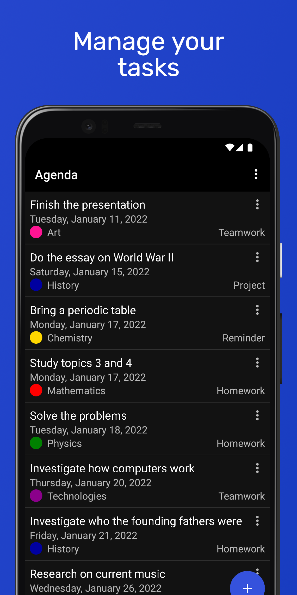
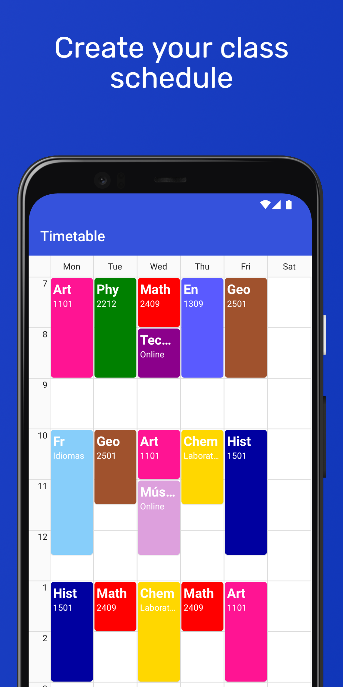
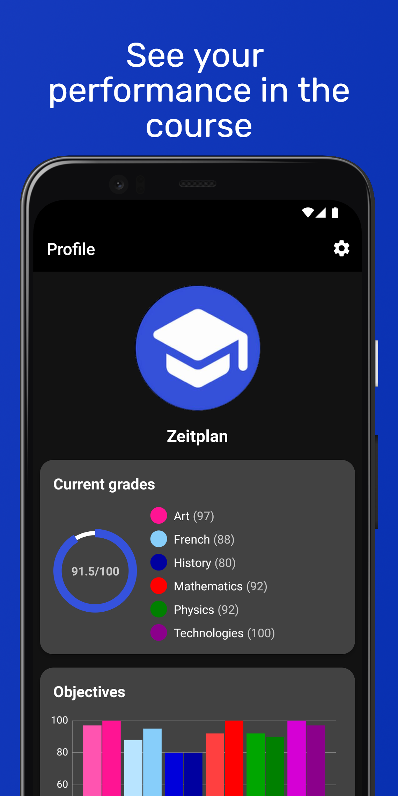
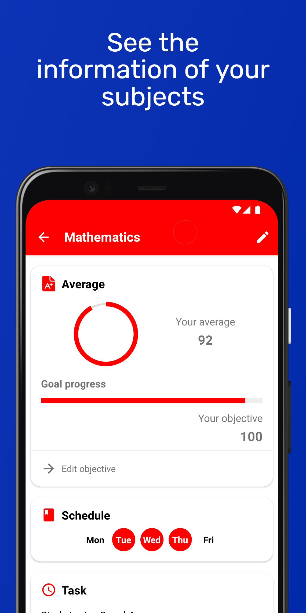
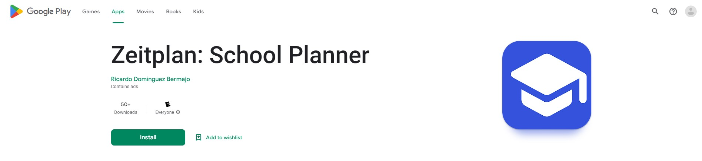

# Zeitplan
Zeitplan is an application to help organize the academic life of students of all ages in order to have everything under control.  
This app was my first project on Android Development, develop in a span of two years (2020-2022).

## Main features
- Create your subjects quickly and easily, where you can assign colors to each of your subjects. When creating the subjects you will be able to see a variety of information, such as the grade at the moment, the name of your teacher and the days that you take that subject.
- With the subjects created you will be able to write down your tasks, exams and reminders of each of them easily and quickly, and manage them in a simple way.
- You can also create your class schedule, where you will see in a simple way when each of your classes starts or ends, or in which room they will take place.
- Manage your grades and see your progress in each subject as well as set goals for each of your subjects.

## Screenshots
| Home | Add Subject | Manage Tasks | School Schedule | Profile Information | Subject Information |
| --- | --- | --- | --- | --- | --- |
|  |  |  |  |   |  |

## Used Technologies & Open-Source libraries
- Minimum SDK level 21
- [Kotlin](https://kotlinlang.org/) based
- Jetpack
	- Lifecycle: Observe Android lifecycles and handle UI states upon the lifecycle changes.
	- ViewModel: Manages UI-related data holder and lifecycle aware. Allows data to survive configuration changes such as screen rotations.
- [Glide](https://github.com/bumptech/glide): Loading images from network.
- [CircleImageView](https://github.com/hdodenhof/CircleImageView): A circular ImageView perfect for profile images.
- [UCrop](https://github.com/Yalantis/uCrop): Image Cropping Library for Android.
- [Gson](https://github.com/google/gson): A Java library that can be used to convert Java Objects into their JSON representation.
- [Firebase](https://firebase.google.com/): For functionalities Authentication (With email and password/Google auth), Firestore, Storage, Crashlytics and Analytics.
- [Admob](https://admob.google.com/home/): Incorporates AdMob for displaying advertisements within the application (Interstitial).
- [MPAndroidChart](https://github.com/PhilJay/MPAndroidChart): A chart library for Android.
- [FloatingActionButton](https://github.com/Clans/FloatingActionButton): Another implementation of Floating Action Button for Android with lots of useful features.
- [Shimmer](https://github.com/facebook/shimmer-android): An Android library that provides an easy way to add a shimmer effect to any view in your Android app.
- [MinTimetable](https://github.com/islandparadise14/MinTimetable):  Is customizable library to generate Timetable of University.
- [CircularProgressBar](https://github.com/lopspower/CircularProgressBar): A circular ProgressBar for Android.
- [Material Dialogs Colors](https://github.com/afollestad/material-dialogs#color): A Dialog with a color chooser.

## Google Play
The application is available for download on Google Play. You can find it by searching for "Zeitplan: School Planner" on the Google Play Store or by following this [link](https://play.google.com/store/apps/details?id=com.domberdev.zeitplan).

